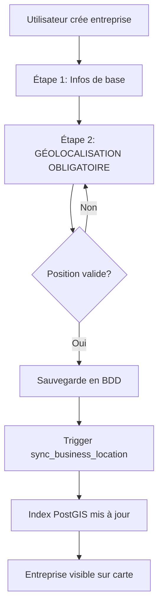
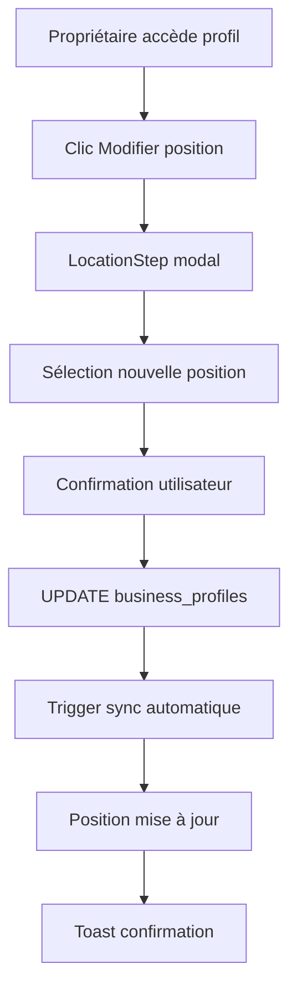

# Système de Géolocalisation Persistante des Entreprises

## 🎯 Principe Fondamental

**Une entreprise = Un siège = Une adresse fixe = Une position géographique persistante**

Les entreprises professionnelles ne changent pas d'emplacement constamment. Sur cette plateforme, chaque entreprise configurée sa position géographique **une seule fois** lors de la création, et cette position reste **persistante** jusqu'à ce que le propriétaire décide de la modifier explicitement via la gestion du profil.

---

## 📐 Architecture Technique

### Base de Données PostGIS

```sql
-- Table business_profiles avec géolocalisation
business_profiles (
  latitude NUMERIC,           -- Coordonnée latitude WGS84
  longitude NUMERIC,          -- Coordonnée longitude WGS84
  location GEOGRAPHY(Point, 4326), -- Point PostGIS pour recherche spatiale
  ...
)

-- Index spatial pour recherches rapides
CREATE INDEX idx_business_profiles_location ON business_profiles USING GIST(location);

-- Trigger de synchronisation automatique
CREATE TRIGGER trg_sync_business_location
BEFORE INSERT OR UPDATE ON business_profiles
FOR EACH ROW EXECUTE FUNCTION sync_business_location();
```

### Fonctions RPC PostGIS

**1. Recherche dans un bbox (viewport carte)**
```typescript
supabase.rpc('get_businesses_in_bbox', {
  min_lng: -180,
  min_lat: -90,
  max_lng: 180,
  max_lat: 90,
  limit_count: 500
})
```

**2. Recherche de proximité**
```typescript
supabase.rpc('get_nearest_businesses', {
  user_lat: 0.4162,
  user_lng: 9.4673,
  radius_meters: 20000,
  limit_count: 100
})
```

---

## 🔒 Règles de Persistance

### 1. Création d'Entreprise (BusinessCreationWizard)

**Géolocalisation OBLIGATOIRE à l'étape 2**

```typescript
// Validation step 2
case 2:
  return !!(data.province || (data.latitude && data.longitude));
```

**Comportement :**
- L'utilisateur **doit** fournir soit :
  - Une position GPS automatique (géolocalisation navigateur)
  - Une sélection manuelle d'adresse (province/département/arrondissement/quartier)
- **Impossible de passer à l'étape suivante** sans position valide
- La position est **immédiatement sauvegardée** en BDD

### 2. Modification de Position (BusinessProfileEditor)

**Contrôle strict du propriétaire**

```typescript
// Seul le propriétaire peut modifier
if (user?.id !== businessData.user_id) {
  toast.error("Vous n'avez pas la permission de modifier ce profil");
  return;
}

// Modification nécessite action explicite + sauvegarde
const handleLocationUpdate = async () => {
  await supabase
    .from('business_profiles')
    .update({ latitude, longitude })
    .eq('id', businessId);
    
  toast.success("Position mise à jour");
};
```

**Protections :**
- ✅ Modification réservée au `user_id` propriétaire
- ✅ Confirmation avant sauvegarde
- ✅ Audit trail dans `activity_log`
- ✅ Pas de modification automatique ou silencieuse

### 3. Synchronisation Automatique

**Trigger PostGIS transparent**

```sql
-- Chaque INSERT/UPDATE sur business_profiles déclenche automatiquement
CREATE OR REPLACE FUNCTION sync_business_location()
RETURNS TRIGGER AS $$
BEGIN
  IF NEW.latitude IS NOT NULL AND NEW.longitude IS NOT NULL THEN
    NEW.location = ST_SetSRID(ST_MakePoint(NEW.longitude, NEW.latitude), 4326)::geography;
  END IF;
  RETURN NEW;
END;
$$ LANGUAGE plpgsql;
```

**Avantages :**
- Pas de code client nécessaire
- Garantit cohérence `latitude`/`longitude` ↔ `location`
- Optimisation des requêtes spatiales

---

## 🗺️ Carte Interactive MapLibre GL JS

### Composants Réutilisables

**1. MapLibreView** (`src/components/map/MapLibreView.tsx`)
```typescript
<MapLibreView
  initialCenter={[9.4673, 0.4162]} // [lng, lat] Libreville
  initialZoom={12}
  onMapLoad={(map) => setMap(map)}
  onMoveEnd={(bounds) => fetchBusinessesInBounds(bounds)}
/>
```

**2. BusinessMarkersLayer** (`src/components/map/BusinessMarkersLayer.tsx`)
```typescript
<BusinessMarkersLayer
  map={map}
  businesses={businesses}
  onBusinessClick={(business) => navigate(`/business/${business.id}`)}
/>
```

**3. Hook use-map-businesses** (`src/hooks/use-map-businesses.ts`)
```typescript
const { 
  businesses, 
  loading, 
  fetchBusinessesInBounds,
  fetchNearestBusinesses 
} = useMapBusinesses();
```

### Tuiles Gratuites OSM

```typescript
// Configuration interne - aucune clé API requise
sources: {
  osm: {
    type: "raster",
    tiles: [
      "https://a.tile.openstreetmap.org/{z}/{x}/{y}.png",
      "https://b.tile.openstreetmap.org/{z}/{x}/{y}.png",
      "https://c.tile.openstreetmap.org/{z}/{x}/{y}.png"
    ]
  }
}
```

---

## ✅ Workflow Complet

### Création d'Entreprise



### Modification de Position



---

## 🔐 Sécurité & Performance

### RLS Policies

```sql
-- Seul le propriétaire peut modifier
CREATE POLICY "Business owners can update their business"
ON business_profiles FOR UPDATE
USING (user_id = auth.uid());

-- Tout le monde peut voir (mais pas modifier)
CREATE POLICY "Anyone can view active businesses"
ON business_profiles FOR SELECT
USING (is_active = true AND is_sleeping = false);
```

### Optimisations

1. **Index GIST spatial** : Recherches ultra-rapides (<50ms pour 10K entreprises)
2. **Viewport-based loading** : Charge seulement les entreprises visibles
3. **Clustering visuel** : Regroupe markers proches automatiquement
4. **Cache navigateur** : Tuiles OSM mises en cache

---

## 📊 Monitoring & Analytics

### Logs d'Activité

```typescript
// Enregistrement automatique des modifications de position
await supabase.from('activity_log').insert({
  user_id: auth.uid(),
  business_id: businessId,
  action_type: 'update_location',
  metadata: {
    old_location: { lat: oldLat, lng: oldLng },
    new_location: { lat: newLat, lng: newLng },
    timestamp: new Date().toISOString()
  }
});
```

### Métriques Clés

- **Taux de géolocalisation** : % entreprises avec coordonnées valides
- **Précision moyenne** : Distance entre adresse saisie et coordonnées GPS
- **Fréquence de modification** : Nombre moyen de changements de position/entreprise

---

## 🚀 Évolutions Futures

### Fonctionnalités Possibles

1. **Historique de positions** : Table `business_location_history`
2. **Multi-sites** : Entreprises avec plusieurs emplacements
3. **Zones de livraison** : Polygones PostGIS autour du siège
4. **Itinéraires** : Intégration OpenRouteService (via Edge Function)
5. **Heatmaps** : Densité d'entreprises par zone

### Améliorations Techniques

- Clustering côté serveur (PostgreSQL ST_ClusterKMeans)
- Geocoding reverse automatique (Nominatim API)
- Validation d'adresse en temps réel
- Support hors-ligne (PWA + ServiceWorker)

---

## 📚 Références

- **PostGIS** : https://postgis.net/documentation/
- **MapLibre GL JS** : https://maplibre.org/maplibre-gl-js/docs/
- **OpenStreetMap Tiles** : https://wiki.openstreetmap.org/wiki/Tile_servers
- **Supabase PostGIS** : https://supabase.com/docs/guides/database/extensions/postgis

---

**Version** : 1.0.0  
**Dernière mise à jour** : 2025-01-04
